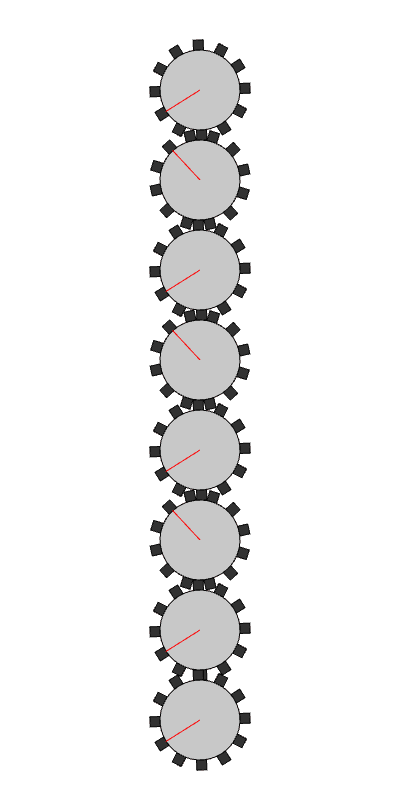

# Impossible Gear Cascade

This project is an interactive optical illusion created with p5.js. It features a vertical stack of gears where the bottom gear appears to rotate in the same direction as the top gear, defying the expected alternating pattern of a standard gear train. The result is a mind-bending visual effect that plays with your perception of motion and mechanics.

## Setup

To run this project locally:

1. Clone the repository:
   ```bash
   git clone https://github.com/mwilcome/gear-illusion.git
   ```
2. Navigate to the project folder:
   ```bash
   cd your-repo-name
   ```
3. Open `index.html` in a web browser. For best results, use a local server:
   - With Python: `python -m http.server 8000` (then visit `http://localhost:8000`)
   - Or use a tool like VS Code’s Live Server extension.

## Usage

- The animation starts automatically when you open the page.
- **Click anywhere** on the canvas to reverse the rotation direction of all gears.
- Observe how the bottom gear rotates in the same direction as the top gear, creating the "impossible" illusion.

## Animation

Here’s a preview of the animation:



## Credits

- Created with [p5.js](https://p5js.org/), a JavaScript library for creative coding.
- Inspired by optical illusions and mechanical paradoxes.

**Note**: The GIF was captured using p5.js’s `saveGif()` function. You can capture your own by adding the following code to `sketch.js` and pressing 's':

```javascript
function keyPressed() {
  if (key == 's') {
    saveGif('myAnimation', 5); // Captures 5 seconds
  }
}
```